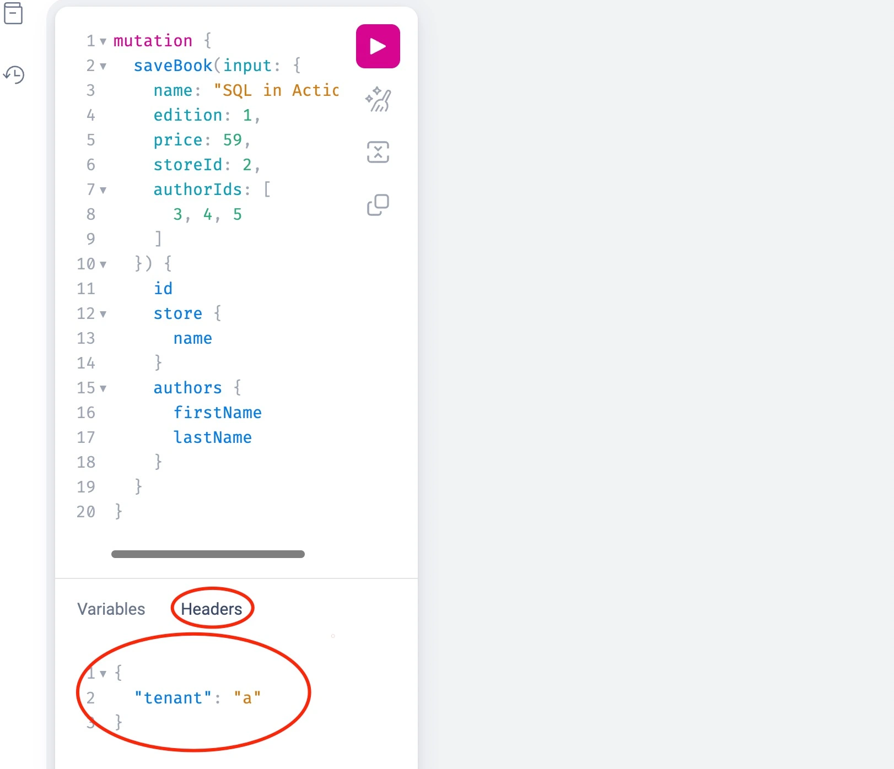

# 使用Jimmer构建GraphQL服务 (Kotlin)

[English](./) | 中文

## 介绍

这里例子涉及到多个功能

> 三大核心功能：[查询任意形状](https://babyfish-ct.gitee.io/jimmer-doc/docs/quick-view/fetch/)，
[保存任意形状](https://babyfish-ct.gitee.io/jimmer-doc/docs/quick-view/fetch/)，
[任意复杂查询](https://babyfish-ct.gitee.io/jimmer-doc/docs/quick-view/dsl/)必然会被使用，故而不罗列在下表中。

<table>
<thead>
<tr>
<th>子项目</th>
<th>相关功能文档链接</th>
</tr>
</thead>
<tbody>
<tr>
<td rowspan="3">model</td>
<td>
<a href="https://babyfish-ct.gitee.io/jimmer-doc/docs/overview/apt-ksp">在定义实体的项目中使用APT</a>
</td>
</tr>
<tr>
<td>
<a href="https://babyfish-ct.gitee.io/jimmer-doc/docs/mapping/advanced/calculated/formula">定义公式计算属性</a>
</td>
</tr>
<tr>
<td>
<a href="https://babyfish-ct.gitee.io/jimmer-doc/docs/mapping/advanced/calculated/transient">定义复杂计算属性</a>
</td>
</tr>
<tr>
<td>repository</td>
<td>
<a href="https://babyfish-ct.gitee.io/jimmer-doc/docs/spring/repository/">Spring Data风格的Repository</a>
</td>
</tr>
<tr>
</tr>
<tr>
<tr>
<td rowspan="4">rtunime</td>
<td>
<a href="https://babyfish-ct.gitee.io/jimmer-doc/docs/cache/">缓存支持</a>
</td>
</tr>
<tr>
<td>
<a href="https://babyfish-ct.gitee.io/jimmer-doc/docs/query/global-filter/">全局过滤器</a>
</td>
</tr>
<tr>
<td>
<a href="https://babyfish-ct.gitee.io/jimmer-doc/docs/mutation/draft-interceptor">保存前拦截器</a>
</td>
</tr>
<tr>
<td>
<a href="https://babyfish-ct.gitee.io/jimmer-doc/docs/mapping/advanced/calculated/transient">为计算属性提供Resolver</a></td>
</tr>
<tr>
<td rowspan="3">service</td>
<td>
<a href="https://babyfish-ct.gitee.io/jimmer-doc/docs/object/view/dto-language">DTO语言</a>
</td>
</tr>
<tr>
<td><a href="https://babyfish-ct.gitee.io/jimmer-doc/docs/overview/apt-ksp">在定义DTO文件的项目中使用APT</a></td>
</tr>
<tr>
<td>
<a href="https://babyfish-ct.gitee.io/jimmer-doc/docs/graphql/">基于Jimmer构建GraphQL服务</a>
</td>
</tr>
</tbody>
</table>

## Kotlin Symbol Processing

项目依赖于[KSP](https://kotlinlang.org/docs/ksp-overview.html)，首次使用Intellij打开本项目时，会发现一些本该被自动生成代码并不存在的问题。对此，可以选择以下任何一种方法：
 
-   先用命令行在要打开的项目目录下执行`./gradlew build`命令完成代码生成，再用Intellij打开项目。
 
-   直接用Intelilj代开项目，暂时无视IDE的错误，依赖下载完毕后，直接运行项目的main方法，所有IDE错误将会自动消失，应用也会被正确启动。

## 运行方式

**在确保缺失的代码被已经被生成并为Intellij所识别后**，即可运行例子。

当前例子支持两种运行方式

### 两种运行方式

-   无缓存模式

    这是默认的模式，为想要快速运行和体验例子的用户提供。
    
    该模式采用H2内嵌数据库，所以无需安装任何外部环境，直接运行[service/.../App.kt](./service/src/main/kotlin/org/babyfish/jimmer/sql/example/kt/App.kt)即可。

-   有缓存模式

    该模式为展示强大的[Jimmer缓存](https://babyfish-ct.gitee.io/jimmer-doc/docs/cache/)而提供，需要外部依赖。
    
    为了更好地示范其普适性，Jimmer提供两种外部环境。

    -   MySQL + Maxwell

        先安装docker，然后执行[env-with-cache/maxwell/install.sh](../../env-with-cache/maxwell/install.sh)完成安装。

        最后，使用参数spring profile参数`-Dspring.profiles.active=maxwell`或`--spring.profiles.active=maxwell`运行[service/.../App.kt](./service/src/main/kotlin/org/babyfish/jimmer/sql/example/kt/App.kt)即可。

    -   Postgres + Debezium

        先安装docker，然后执行[env-with-cache/debezium/install.sh](../../env-with-cache/debezium/install.sh)完成安装。

        最后，使用参数spring profile参数`-Dspring.profiles.active=debezium`或`--spring.profiles.active=debezium`运行[service/.../App.kt](./service/src/main/kotlin/org/babyfish/jimmer/sql/example/kt/App.kt)即可。

    >   两种环境选择一种即可，如果都安装，可能因内存不足而导致docker容器发生错误。如果真的要这么做，建议为docker分配3GB内存。

无论通过哪种运行模式启动了项目，均可以通过`http://localhost:8080/graphiql` *(注意，这里有一个`i`)* 访问服务。

##  租户身份

为了展示[全局过滤器](https://babyfish-ct.gitee.io/jimmer-doc/docs/query/global-filter/)，本例子的`Book`类型采用了多住户模式。

如果要以一个租户的身份访问服务，需要在HTTP请求头中设置`tenant`，其值为`a`和`b`。

>   默认数据中只有两个租户：`a`和`b`。当然，用户可以添加更多的租户。

-   对于查询操作而言，这个HTTP请求头是可选的，如果没有，就查询所有租户的书籍。

-   对于数据保存操作而言，这个HTTP请求头是必须，如果没有，服务端会抛出异常。

可以在`http://localhost:8080/graphiql`页面的左下方设置HTTP请求头：

---

[⇦ 上一个例子 ⇦](../jimmer-sql-kt/README_zh_CN.md) | [⇧ 返回上级 ⇧](../README_zh_CN.md) | [⇨ 下一个例子 ⇨](../jimmer-cloud-kt/README_zh_CN.md)
